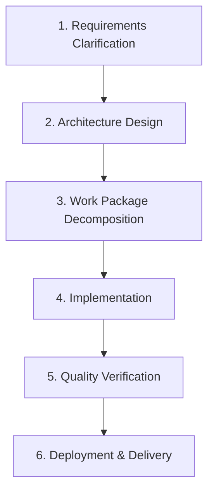

# AGENTS.md

This file defines a standalone, reusable project bootstrapping specification for AI Agents. It targets future new projects: the user first writes down a basic client requirement, then lets the Agent keep moving forward following this document and the phase workflows under `skills/`, until a first runnable, acceptance-ready demo with as few known defects as possible is delivered.

This specification is a plain-text working agreement. It does not depend on any specific slash command, proprietary tool name, or runtime hook. Claude Code can read `AGENTS.md` directly; other Agent runtimes can follow the same process manually or automatically.

---

## 1. Scope

This specification applies to greenfield builds, refactors, and first-demo delivery of complex to-B business software, and is especially suited to the following kinds of projects:

- **Internal tools and business systems**: document management, warehouse management, approval flows, audit flows, reporting platforms, master data platforms, etc.
- **Systems with strong domain constraints**: business rules come from regulations, industry standards, client contracts, audit requirements, or internal policies, and cannot be guessed from generic CRUD.
- **Systems with multi-level data models**: tree-structured directories, lifecycle states, version chains, reference relationships, file attachments, bulk import/export, and other complex objects.
- **Hybrid deployment systems**: may run as cloud multi-tenant services, and may also need to ship as local single-machine or offline desktop deliverables.

---

## 2. Using This as a Standalone Repo

When this specification is used as its own repo, the Agent initializes a new project as follows:

1. Read this file and the 6 phase workflows under `skills/`.
2. Write the client's one-line requirement into `docs/requirements/client-brief.md`.
3. Put regulations, contracts, sample files, client templates, or read-only standards into `constraints/`.
4. Start from `skills/1-requirements-clarification.md` and proceed in order, unless the user explicitly asks to run only a specific phase.
5. On entering each phase, first read the corresponding skill, then read the project documents that phase depends on.
6. Every time code, architecture, interfaces, data models, or deployment processes change, update the corresponding documents and changelog in sync.
7. Until the Release Gate has been passed, do not claim the demo is deliverable.

`skills/` currently uses flat Markdown files for easy human reading and cross-runtime reuse. If a runtime only recognizes directory-style `SKILL.md`, each phase file can be moved or copied to `skills/<phase-name>/SKILL.md` with the body rules unchanged.

---

## 3. Project Skeleton Requirements

New projects must be set up with the following structure. Directories may be filled in gradually, but key documents must not be left scattered across source directories long-term.

```
├── AGENTS.md
├── skills/
│   ├── 1-requirements-clarification.md
│   ├── 2-architecture-design.md
│   ├── 3-work-package-decomposition.md
│   ├── 4-implementation.md
│   ├── 5-self-testing.md
│   └── 6-deployment-packaging.md
├── docs/
│   ├── requirements/
│   │   ├── client-brief.md
│   │   └── refined-brief.md
│   ├── architecture/
│   │   ├── tech_stack.md
│   │   ├── backend_architecture.md
│   │   ├── frontend_architecture.md
│   │   ├── database_design.md
│   │   └── api_design.md
│   ├── decisions/
│   │   ├── ADR-001-template.md
│   │   └── ADR-NNN-<topic>.md
│   ├── work-packages/
│   │   ├── WP-01-<slug>.md
│   │   └── WP-NN-<slug>.md
│   ├── tech-references/
│   │   └── <stack-or-domain>.md
│   └── changelog/
│       ├── INDEX.md
│       └── YYYY-MM.md
├── constraints/
├── backend/
├── frontend/
├── tests/
├── scripts/
└── docker-compose.yml
```

### 3.1 Document Responsibilities

- `docs/requirements/`: the client's original requirements and the refined requirements clarified by the Agent.
- `docs/architecture/`: the five core architecture documents — the authoritative context that must be read before changing backend, frontend, database, or API.
- `docs/decisions/`: ADRs. Any technical/business decision that is repeatedly changed, contested, or has a large blast radius must be recorded.
- `docs/work-packages/`: development plans split into deliverable units, recording dependencies, DoD, test commands, and handoff state.
- `docs/tech-references/`: tech stack and domain implementation references, read-only by default; when adding a new technical pattern, document it first, then reuse it.
- `docs/changelog/`: change history, root causes, impact, and build fingerprints.
- `constraints/`: read-only sources of domain constraints. The Agent must not bypass these rules for implementation convenience.

---

## 4. Workflow Skeleton

By default the Agent proceeds through 6 phases in order. It must not jump into coding before the preceding phases are complete; even urgent fixes must backfill minimal requirements, impact analysis, and regression test records.



1. `skills/1-requirements-clarification.md`: one-line client request -> refined requirements.
2. `skills/2-architecture-design.md`: refined requirements -> five architecture documents and ADRs.
3. `skills/3-work-package-decomposition.md`: architecture -> WP specs and dependency topology.
4. `skills/4-implementation.md`: code per WP, keeping documents updated in sync.
5. `skills/5-self-testing.md`: unit, integration, E2E, and build-time hard assertions.
6. `skills/6-deployment-packaging.md`: Docker/desktop/client delivery packages and cold-install acceptance.

---

## 5. Core Agent Behavior Rules

### 5.1 Ask by Default, Don't Assume

When facing uncertainty, the Agent first searches for existing evidence within the project, then decides whether to ask:

1. First check `docs/requirements/`, `constraints/`, `docs/architecture/`, `docs/decisions/`, `docs/work-packages/`, `docs/tech-references/`, and `docs/changelog/`.
2. Then check existing code, tests, and script implementations.
3. If existing docs and code provide a consistent precedent, follow it and cite the basis.
4. If docs and code conflict, record the conflict first, and prefer proposing a minimal ADR or a clarifying question.
5. If a hard red line is involved, stop implementation and ask the user for confirmation.

### 5.2 Hard Red Lines That Require Asking

The Agent must not decide the following on its own:

1. **Tech stack selection and new external dependencies**: adding a global state library, ORM, queue system, native npm dependency, packaging plugin, payment/signing/encryption SDK, etc.
2. **Database schema changes**: adding/removing tables, modifying core fields, changing field types, weakening constraints, changing migration strategy.
3. **Irreversible or destructive operations**: resetting databases, wiping object storage, deleting client data, force-pushing branches, bulk-overwriting files.
4. **Domain regulation or security decisions**: bypassing `constraints/`, lowering authentication levels, changing encryption/signature-verification algorithms, changing audit-trail policy.
5. **Deviating from the five architecture documents**: changing the API root path, splitting ports, changing the deployment mode, replacing the storage backend, changing the frontend routing strategy.
6. **Changes to delivery commitments**: lowering the Release Gate, skipping cold-install tests, marking known failures as deliverable.

### 5.3 Documentation First

Before any backend, frontend, database, API, or deployment script change, the following preparation must be complete:

- Identify the associated `docs/work-packages/WP-NN-<slug>.md`.
- Read the corresponding architecture documents: `backend_architecture.md` for backend, `database_design.md` for database, `api_design.md` for API, `frontend_architecture.md` for frontend, and `tech_stack.md` plus related release documents for deployment.
- Search `docs/changelog/` for the same issue or similar pitfalls.
- When a new pattern is involved, update `docs/decisions/` or `docs/tech-references/` first.

### 5.4 Small, Closed-Loop Steps

The Agent should make small, verifiable changes. Every step must be able to answer:

- What changed?
- Why was it changed?
- Which modules and data are affected?
- Which tests prove it?
- Does it require a migration, rebuild, cold install, or client documentation update?

---

## 6. Changelog Mechanism

After every change to code, scripts, architecture, interfaces, data models, or delivery process, `docs/changelog/` must be updated.

Each changelog entry must include at least:

- **Time**: YYYY-MM-DD HH:MM.
- **Scope of change**: files, modules, work packages.
- **What changed**: the specific changes made.
- **Reason and root cause analysis**: why the change was made and what the mechanism of the original problem was.
- **Impact assessment**: whether it involves data migration, interface contracts, frontend rendering, Electron/native rebuild, deployment scripts, or client documentation.
- **Verification results**: tests, builds, cold installs, or manual acceptance actually performed.
- **Related work packages/ADRs**: the corresponding WP or ADR numbers.

`docs/changelog/INDEX.md` maintains version status, milestones, build fingerprints, open risks, and Release Gate status.

---

## 7. High-Risk Engineering Constraints

### 7.1 Dual Databases and Local Deployment

If the project supports both a server-side database and a lightweight local database:

- JSON/array/complex-object fields must have a unified serializer/parser.
- create/update/list/detail responses must go through the same serialization exit point; raw-spreading ORM records is forbidden.
- The two schemas must have a parity check; the build fails if their field sets differ.
- Both the write side and the read side must be covered by tests; fixing only the response layer is not enough.

### 7.2 SPA and Same-Origin Routing

If the frontend and backend converge into a single same-origin service after packaging:

- The backend must serve the frontend build artifacts.
- The SPA catch-all route must be registered last and must exclude API, health, static asset, and file-stream endpoints.
- Postbuild verify must check `index.html`, assets, at least one JS chunk, and the health endpoint.

### 7.3 Electron / Desktop Delivery

Desktop or local single-machine packages must explicitly handle:

- All write paths anchored to a writable data directory; never rely on `cwd()`.
- Forked child processes receive the full set of environment variables explicitly, not relying on the dev machine's shell.
- Native modules rebuilt for the Electron ABI and target platform.
- External resources, rule files, templates, and engine binaries packaged into the artifact, with postbuild assertions.
- App window lifecycle checked by runtime validity, not merely by whether the object is non-null.

### 7.4 Dynamic Lists and Upload Experience

When uploads, imports, async refreshes, or fast local writes are involved:

- Dynamic GET lists default to `Cache-Control: no-store`.
- Refreshes after optimistic inserts should use a merge-additive or equivalent strategy so stale responses don't overwrite newer state.
- Upload controls must not be conditionally unmounted during upload; use disabled + overlay/progress.
- The data shape returned by create must match the shape returned by list.

### 7.5 Build-Time Hard Assertions

Any key metadata that belongs to domain rules, controlled vocabularies, templates, directories, permission matrices, validation rules, license public keys, or migration state must fail fast at build or packaging time:

- Warning and skipping is not allowed.
- An empty directory or marker file must not stand in for real completion.
- Key files, per-table row counts, hashes, schema parity, and resource existence must be checked.

---

## 8. Invocation Modes

### 8.1 Single-Agent

One Agent runs from phase 1 to phase 6. On entering each new phase:

1. Output "Loading Skill: <file name>".
2. Read the phase skill.
3. Read the project documents that phase depends on.
4. Carry out the phase tasks.
5. Update the changelog and work package status.

### 8.2 Multi-Agent

Multiple Agents can collaborate by role:

- **Architect-Agent**: phases 1-2, responsible for requirements, constraints, the five architecture documents, and ADRs.
- **Planner-Agent**: phase 3, responsible for WP decomposition and dependency topology.
- **Coder-Agent**: phase 4, responsible for implementing per WP and keeping documents in sync.
- **QA-Agent**: phase 5, responsible for the test matrix, reproduction, regression, and hard assertions.
- **Release-Agent**: phase 6, responsible for packaging, cold install, and the client delivery checklist.

At handoff, the following must be stated explicitly: `READY_FOR_NEXT`, remaining risks, tests run, tests not run, and the documents the next role should read first.

---

## 9. Release Gate

Before delivering any demo, trial, or official release, a four-stage acceptance must be completed:

### A. Source

- The five architecture documents match the code.
- Schema parity, API contract, routing strategy, and permission strategy checks pass.
- All environment variables, write paths, resource paths, and health endpoints are explicitly configured.
- No sensitive information is logged in plain text.

### B. Build

- Frontend, backend, scripts, desktop shell, or container image builds are all green.
- Postbuild verify checks resources, engines, static files, rule data, and hashes.
- Native module ABI matches the target runtime.
- A SHA256 or equivalent build fingerprint is generated.

### C. Cold Install

- Install/start on a clean machine or clean container.
- First launch automatically creates directories, runs migrations and seeds, and extracts resources.
- The core business main flow runs end to end.
- No uncaught ERRORs in the Console / backend logs.
- No lingering processes after exit; data and license state are retained after restart.

### D. Client

- Delivery package, user guide, known limitations, and backup/uninstall instructions are complete.
- Activation/licensing/account/initial password flows are operable.
- Risks such as unsigned builds, notarization, antivirus, and browser security policies are written into the client notes.

If any item fails, the version status remains `Unreleased` and must not be delivered.
