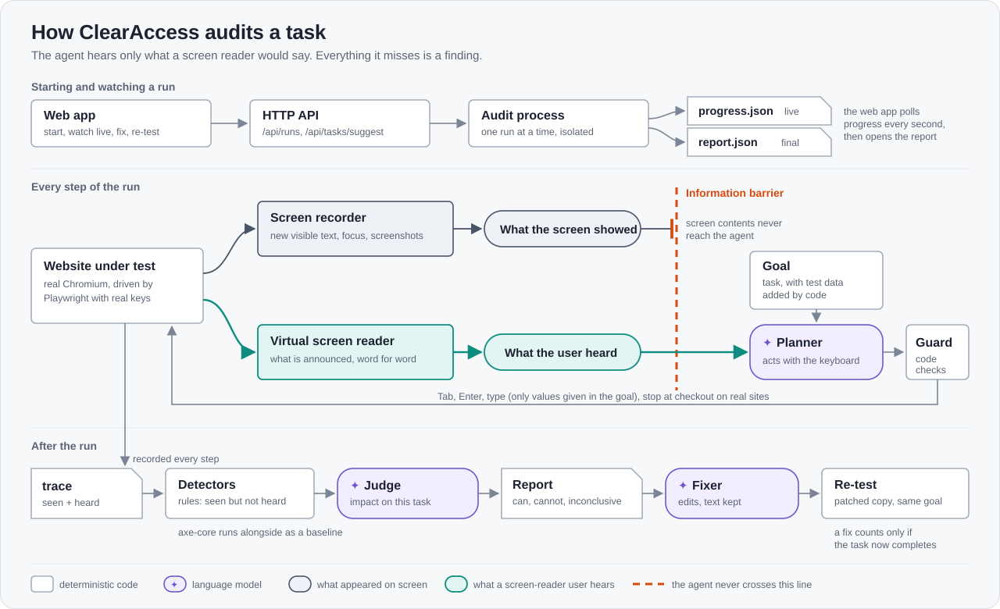

# ClearAccess — task-level accessibility audit

We don't score pages. We check whether a screen-reader or keyboard user can actually **finish checkout**, show exactly where they get stuck, then fix the code and re-run the same task to prove the fix works.

Give it a URL. An AI agent that hears only what a screen reader would say works through the site with the keyboard, the way a blind shopper would. Every step records what appeared on screen next to what the user actually heard, so a silent "Card declined" is caught the moment it happens. Blocking problems get a code fix, and the fix only counts if the same task then completes.

Built at Test Flight, the Glasswing Ventures hackathon, September 26 and 27, 2026.

Team: TODO team name — TODO Name (@github), Name (@github), Name (@github), Name (@github)


## The problem

Web accessibility lawsuits keep growing, and they concentrate on e-commerce transaction flows. US federal website-accessibility suits reached 3,117 in 2025, up 27% (Seyfarth). The complaints describe **tasks that can't be finished**, not code that fails a rule: a blind user can't complete an order, the "added to cart" confirmation is never announced, a card error appears on screen but the screen reader stays silent. In *Gomez v. Trinitas Cellars* the court found no ADA violation for unreadable icons because the plaintiff didn't show how they blocked use of the site. What matters is whether the task is blocked.

Static scanners (axe, Lighthouse) check pages, not tasks. They catch missing alt text but miss dynamic problems — announcements, focus traps, focus loss — which only show up when you actually operate the page. Today that gap is filled by manual audits: slow, expensive, and redone on every release.

Who has it: engineering, QA and legal at mid-size e-commerce and restaurant brands, before every release.


## Who pays

- **Primary:** mid-size e-commerce and restaurant brands. Subscription priced per site and per monitored critical flow (checkout, signup). Budget: QA/engineering, pulled by legal risk.
- **Also:** accessibility audit firms (seats — automates their manual flow testing), public universities and local governments facing the April 2027 WCAG 2.1 AA deadline.
- Pricing sits between rule-engine seats and per-project manual audits.
- Customers audit **their own** sites, usually staging: they verify the domain, whitelist our runner, provide test accounts and test cards, and get fixes as pull requests that CI re-runs before merge.
- Expansion: the same accessibility tree is what AI shopping agents read. "Can a non-visual user finish checkout?" is also "can an agent buy on your site?"

We do not claim compliance certification or legal protection.


## How it works



**Perception parity.** After every keypress we record, deterministically, what appeared **on screen** and what **assistive tech conveyed**: the words an open-source virtual screen reader ([Guidepup](https://github.com/guidepup/virtual-screen-reader), MIT) running in the page actually said, e.g. `button, Pay` or `assertive: Card number is invalid`, plus focus role/name/description from the accessibility tree. Visible changes with no programmatic path to the user are reported with step, screenshot, element and WCAG criterion. Our own rules make the same call independently; the report's `stats.spokenAgreement` shows where the two agree (on the test page they agree everywhere except the step where the payment dialog opens: see Limits).

**Where the AI does work rules can't:**
1. **Planner** — operates any site toward a goal using only keyboard + screen-reader information. No per-site scripts to maintain. Its outcome doubles as "can a structure-only AI agent complete this purchase?"
2. **Judge** — separates "added to cart" from a rotating promo banner, and grades each issue by *whether it blocks this task*, not by WCAG level. It can only label detector output — every finding traces back to recorded evidence.
3. **Name quality** — "🛒" is a non-empty name (axe passes it); a screen reader reads it as "shopping cart", which doesn't say whether the button adds to the cart or opens it.
4. **Fix + verify** — generates a code fix, applies it to a copy of the site, re-runs the same task. A fix counts only if the task now completes.
5. **Task suggestion** — give only a URL and it proposes what to test (a purchase first, then other kinds such as search or cart edits), from the same page text a screen-reader user gets.

**Guard rails, enforced in code rather than in prompts:**
- The planner may only type values that appear word for word in the goal. Test data (e.g. payment test cards) is appended to the goal by code from `config/test-data/`, never written by a model.
- Verdicts are three-valued: *can complete*, *cannot complete*, or *inconclusive* when the task itself lacked data, so a missing card number is never blamed on the website.
- Real-site mode stops at checkout, refuses to type into card, CVV, expiry or password fields, and keeps no user-entered or autofilled values.

Details: [`docs/ARCHITECTURE.md`](docs/ARCHITECTURE.md), API: [`docs/API.md`](docs/API.md), report format: [`docs/REPORT_FORMAT.md`](docs/REPORT_FORMAT.md).


## Results so far

Fake shop (3 task flows), the small test page, and the W3C Before-and-After Demonstration "after" page; each flow in its
original (planted barriers) and hand-fixed version. One recorded key script per flow, so every tool sees the same page states.
Barriers were planted by a teammate who had read the detector code (see `sites/shop/README.md`), so some overfitting is possible.

**Detection rate: planted barriers, ours vs axe (judge off)**

| dataset | variant | tool | planted | detected | missed | false positives |
|---|---|---|---|---|---|---|
| shop-main | original | ours (judge off) | 8 | 7 | B3† | 0 |
| shop-main | original | axe (WCAG rules) | 8 | 0 | B1 B2 B3† B4 B5 B6 B7 B8 | 0 |
| shop-main | fixed | ours (judge off) | 0 | 0 | – | 0 |
| shop-main | fixed | axe (WCAG rules) | 0 | 0 | – | 0 |
| shop-second | original | ours (judge off) | 4 | 4 | – | 0 |
| shop-second | original | axe (WCAG rules) | 4 | 0 | B5 B8 B9 B10 | 0 |
| shop-second | fixed | ours (judge off) | 0 | 0 | – | 0 |
| shop-second | fixed | axe (WCAG rules) | 0 | 0 | – | 0 |
| shop-popup | original | ours (judge off) | 1 | 1 | – | 0 |
| shop-popup | original | axe (WCAG rules) | 1 | 0 | B11 | 0 |
| shop-popup | fixed | ours (judge off) | 0 | 0 | – | 0 |
| shop-popup | fixed | axe (WCAG rules) | 0 | 0 | – | 0 |
| testpage | original | ours (judge off) | 6 | 6 | – | 0 |
| testpage | original | axe (WCAG rules) | 6 | 0 | T1 T2 T3 T4 T5 T6 | 0 |
| testpage | fixed | ours (judge off) | 0 | 0 | – | 0 |
| testpage | fixed | axe (WCAG rules) | 0 | 0 | – | 0 |
| w3c-bad | fixed | ours (judge off) | 0 | 0 | – | 0 |
| w3c-bad | fixed | axe (WCAG rules) | 0 | 0 | – | 0 |
| **total** | | ours (judge off) | 19 | 18/19 (95%) | 1 | 0 |
| **total** | | axe (WCAG rules) | 19 | 0/19 (0%) | 19 | 0 |

† vision-only barrier (B3): text printed on an image; no keyboard/screen-reader rule can see it, so it is counted as a miss for us too.
Detection counts every planted barrier, including those expected to be irrelevant to the task (expectedImpact none): finding them is the detectors' job; whether they matter is the judge's.
Same trace for every tool (recorded key scripts `eval/keys.*.json`). axe counts only WCAG-tagged rules, per affected element; findings are matched to barriers by `data-barrier` id, unmatched = false positive.
axe best-practice rule nodes, not counted above: shop-main/original 1, shop-main/fixed 1, shop-second/original 1, shop-second/fixed 1, shop-popup/original 1, shop-popup/fixed 1, testpage/original 7, testpage/fixed 5, w3c-bad/fixed 28.
w3c-bad = W3C Before-and-After Demonstration, "after" (accessible) version: nothing planted, so it only measures false positives.
keyboard-a11y-tester: not included in this comparison.

**Impact accuracy: same trace, judge on vs off**

| dataset | variant | detected barriers | agree, judge off (defaults) | agree, judge on | judge off: expected→given | judge on: expected→given | FP judge off → on | judge errors |
|---|---|---|---|---|---|---|---|---|
| shop-main | original | 7 | 6/7 (86%) | 6/7 (86%) | B7 block→degrade | B1 degrade→block | 0 → 0 | 0 |
| shop-main | fixed | 0 | – | – | – | – | 0 → 0 | 0 |
| shop-second | original | 4 | 4/4 (100%) | 4/4 (100%) | – | – | 0 → 0 | 0 |
| shop-second | fixed | 0 | – | – | – | – | 0 → 0 | 0 |
| shop-popup | original | 1 | 1/1 (100%) | 1/1 (100%) | – | – | 0 → 0 | 0 |
| shop-popup | fixed | 0 | – | – | – | – | 0 → 0 | 0 |
| testpage | original | 6 | 4/6 (67%) | 5/6 (83%) | T3 block→degrade, T5 none→block | T1 degrade→block | 0 → 0 | 0 |
| testpage | fixed | 0 | – | – | – | – | 0 → 0 | 0 |
| w3c-bad | fixed | 0 | – | – | – | – | 0 → 0 | 0 |
| **total** | | 18 | 15/18 (83%) | 16/18 (89%) | | | 0 → 0 | 0 |

For every barrier the detectors found, the impact level we report for it (block / degrade / none = irrelevant to this task; the most severe if several findings hit it) is compared with `expectedImpact` in `eval/groundtruth/`, i.e. what the barrier does to that flow's task. Judge off = each detector's fixed default level, shown as the baseline.
expectedImpact is scored on the recorded route: e.g. the testpage script types a short card number on purpose, a user's typo; recovering from it is part of the task, and a user who never hears the error cannot correct it and pay, so T3 (unannounced error) and T4 (dialog trap) are block.
**What the judge is for:** it never adds findings and does not raise the detection count; its job is to rate each finding's impact on the task (including marking task-irrelevant ones as none). False positives are counted as in the detection table; a finding the judge rates none is not counted as reported.

Judge-on numbers depend on the model (`MODEL_JUDGE`); verdicts are cached in `.cache/llm`, so replaying the same recording on this machine gives the same numbers; another machine or model may differ slightly. A fresh recording can also differ: the demo pages' rotating banner lands in different steps, so the judge sees a slightly different prompt.

Reproduce: `node eval/run.mjs --replay eval/traces` (no browser; the judge columns need `.env`).
`node eval/run.mjs` (no flag) records every flow afresh in Chromium: the judge-off and axe rows come out the same; the judge-on columns can differ (see above).


## What's real and what's mocked

- **Real:** browser automation on real Chromium, accessibility-tree reads via CDP, the virtual screen reader's output, all detectors, the axe-core comparison, and every LLM call (Sciforium, DeepSeek V4.1 Flash for planner, judge, fixer and task suggestion). The web app drives the real API end to end: start an audit, watch it live, inspect findings, fix and re-test.
- **Synthetic:** the demo shop (`sites/shop`) and test page are ours, with planted barriers and a hand-fixed reference version; product images are our own SVG illustrations. The W3C Before-and-After Demonstration is used only to measure false positives.
- **Real-site segment:** detection only — no fixes, stops before checkout, never types payment data; results are shown from a cached run and not committed to this repo. In one pre-run on a large retailer, "Add to Bag" opened a confirmation panel while focus fell to the page body, so a screen-reader user heard nothing.
- **Limits:** a virtual screen reader is not NVDA/JAWS (we say "no programmatic way to be announced"); when focus moves onto a dialog it says the dialog's name only, where NVDA/JAWS usually also read the dialog's text, so the planner may hear less there than a real user would (our rules count that text as heard; `stats.spokenAgreement` lists each such step); cross-origin iframes (e.g. Stripe) are invisible to us; text printed inside images needs a visual check we haven't built (the one barrier we miss); focus visibility (D5) compares the focused element's own computed style with an unfocused copy of it, so a focus ring drawn only by a parent's `:focus-within` is reported as missing (left to the judge), and visually hidden inputs whose ring is drawn on a sibling label are not judged; the planner moves with Tab and does not browse like an experienced screen-reader user, so on large sites it is slow and our verdicts lean strict; the judge tends to rate emoji-only names as blocking where we expect degrading; suggested tasks can vary between runs; at real scale, noise filtering on busy sites needs more tuning. The web app audits only this server's own sites; real sites run from the command line, by design, because the runner really operates the target. In real-site mode the tool does not record or send what the user typed or the browser autofilled: field values are kept only for fields the agent typed into itself (never for sensitive ones), and field text is dropped from page text. Local per-step screenshots can still show it; they are never sent to a model or committed.


## Running it

```bash
cp .env.example .env            # Sciforium key and model strings (with the /deployments/<id>/ prefix); never committed
npm install
npx playwright install chromium # or set CHROME_BIN to a local Chromium
npm test                        # recorded traces only, no browser or keys needed
npm run serve                   # sites, reports and API on http://127.0.0.1:8080 (local only)

# web app (second terminal)
cd FRONTEND && npm install && npm run dev      # http://127.0.0.1:8443, proxies /api, /runs, /fixtures to 8080
```

Command line:

```bash
# deterministic run, no LLM:
node cli.mjs audit --url http://localhost:8080/testpage/original/ --goal "Buy the canvas tote bag" \
  --script eval/keys.testpage.json --no-judge
# autonomous run with planner + judge (omit --goal to let it pick the task):
node cli.mjs audit --url http://localhost:8080/shop/original/ --goal "Buy a canvas tote bag" --site sites/shop/original
node cli.mjs fix   --run runs/<id>
node cli.mjs rerun --run runs/<id>
node cli.mjs suggest --url http://localhost:8080/shop/original/ --generate
# add --trace to any audit to debug it step by step (or drop the zip on https://trace.playwright.dev, parsed locally):
npx playwright show-trace runs/<id>/trace.zip
# real site (detection only): open a separate Chrome, clear any captcha, then press Enter when asked
scripts/real-chrome.sh https://example.com/
node cli.mjs audit --mode real --cdp http://localhost:9222 --goal "Search for a tote bag and add one to the cart"
# evaluation tables above:
node eval/run.mjs --replay eval/traces
```

CI (`.github/workflows/a11y-audit.yml`) audits the fixed shop on every push and fails the check on any blocking finding; the report lands in the job summary.


## Where it goes next

- Verified domains instead of "local sites only", so customers run audits on their own staging from the web app.
- Fixes delivered as pull requests to the customer's repo, re-tested by the same CI check before merge.
- Browse-mode actions for the planner (read the next line, jump to a heading), to model experienced screen-reader users.
- A visual check for text inside images.
- A real-screen-reader verification mode (NVDA / VoiceOver via Guidepup) for the steps that matter most.


## Built this weekend / third-party components

Prior work: none. We did a small feasibility spike before the weekend to check the approach; none of that code is in this repo, and everything here was built during Test Flight.

Third-party components, used unchanged:
- [`@guidepup/virtual-screen-reader`](https://github.com/guidepup/virtual-screen-reader) (Guidepup, MIT) simulates what a screen reader announces. What we built on top: the per-step comparison of what appeared on screen with what the screen reader conveyed, the planner that only ever hears that output (information barrier), and the fix-and-verify loop.
- [Playwright](https://playwright.dev) drives Chromium; [axe-core](https://github.com/dequelabs/axe-core) is the static baseline we compare against; [Ajv](https://ajv.js.org) validates reports against `docs/report.schema.json` in tests only.
- The web app uses React and Vite.
- `sites/bad/` is an unmodified local copy of the W3C Before and After Demonstration ("after" version), redistributed under the W3C Document and Software Licenses (see `sites/bad/README.md`), used only to measure false positives.
