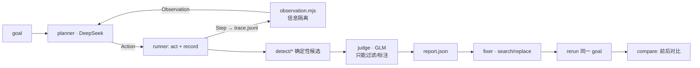

# 工程架构（repo 版）

本文件以《任务级无障碍审计：工程架构》为基础，只写**与原文档不同的决定**、**冻结的接口**和**代码在哪**。原文档里的产品形态、AI 环节说明、真实网站模式、降级顺序仍然有效。

## 0. 现状（Sat Sep 26 下午）

- 骨架已能端到端运行：Playwright 驱动真实 Chromium → recorder 记录 → CDP 读取焦点 → 检测器 → 报告。在 `sites/testpage` 上用预录按键跑通：**原版检出 4/4 个埋入障碍、0 误报；axe 检出 0/4（WCAG 规则）；修复版 0 误报**。结果存放在 `fixtures/testpage-*`。
- 已实现：`contracts`、`runner/*`、`detect/*`、`agent/observation`、`agent/llm`（路由、缓存、回退）、`planner`/`judge`（代码与 prompt 草稿，**尚未连接 Sciforium 测试**）、`fix/apply`（search/replace + 文案保护）、`report/build`、`eval/score`、`cli`、CI workflow、`test/` 下的回归测试（数量以 `npm test` 输出为准）。
- 未做：真实假电商站（`sites/shop`）、viewer 界面、fixer 的真实调用、焦点可见性 D5（计划 07 方案 A：计算样式对比）、D6。
- 计划 16 已接入虚拟读屏器（Guidepup，MIT）：每步的 `spoken` 是它的原话，planner 听到的就是它（见 §4）。

## 1. 流水线



执行阶段每步调用一次 LLM（planner）；分析阶段对候选问题批量调用 judge（每批 12 条）。

## 2. 目录

| 目录 | 内容 |
|---|---|
| `src/runner/` | `session`（启动/接管浏览器、单步执行）、`recorder.js`（页面内注入）、`observe`（CDP 焦点、AX 文本）、`act`、`axe`、`guard`（真实网站安全限制）、`vsr`（虚拟读屏器注入与读取） |
| `src/agent/` | `observation`（**信息隔离**）、`llm`、`planner`、`judge`、`prompts/` |
| `src/fix/` | `fixer`（LLM）、`apply`（应用 edits + 保护） |
| `src/detect/` | D1–D6，纯函数 |
| `eval/`、`sites/shop/` | 标准答案、打分、按键脚本、假电商站 |
| `src/report/`、`viewer/`、README | report 生成、三栏界面、叙事 |
| `src/audit.mjs`、`cli.mjs` | 编排与命令行 |

## 3. 冻结的数据契约（`src/contracts.mjs`）

与原文档的差异：

1. **Step** 新增 `title`、`pageLoad`、`pageText`（仅在页面跳转时记录 AX 树文本）、`focusVisible`，以及可选的 `rect`（供 viewer 画框）；`focusAfter` 新增 `description`、`barrierId`、`inModal`。
2. **Change** 用 `referencedBy: string[]` 替换 `associatedWithFocus`：记录哪些元素通过 describedby/errormessage 引用了这条变化。这样 D1（播报）和 D1b（关联）可以分开判断。
3. **Action** 新增 `start`（页面初次加载，由 runner 产生）；`done`/`stuck` 同样写入 trace，trace 的最后一步就是任务结果。
4. **Candidate**（检测器输出）和 **Finding**（judge 输出）分开定义。Finding 新增 `layer`（presence/association/announcement/operation）、`judged` 和 `candidateId`；`fix` 改为 `{edits:[{file,old,new}], rationale}`。
5. **Action** 的 `type` 新增可选 `replace: boolean`：为 true 时 runner 先全选（Control/Meta+A）再输入，用来更正输入框内容；real 模式下 guard 对它同样拒绝敏感输入框。**FocusInfo** 新增可选 `value`：焦点节点在 AX 树里的 value（读屏器聚焦输入框时读出的内容，密码框由浏览器遮蔽为 •），planner 的 `focusValue` 只来自它。real 模式下只保留 planner 本次运行自己输入过、且不敏感的字段的 value，其他字段为 `value: null` 加 `valueRedacted: true`，`pageText` 也不含字段内的文字。
6. **Step** 新增可选 `shotSize: {w, h, dpr}`：截图的实际像素宽高和 devicePixelRatio（截图失败时没有这个字段）。rect 都是 CSS 像素，× dpr 才是截图像素。本地模式固定 1280×800、dpr 1；real 模式接管的是用户的 Chrome，大小不固定。`report.json` 的 `timeline[].shotSize` 原样带出。
7. **Step** 的 `spoken` 从一直为空变成虚拟读屏器（`@guidepup/virtual-screen-reader`，由 `src/runner/vsr.mjs` 注入页面）本步的原话，例如 `button, Pay`、`assertive: Card number is invalid`、页面加载后的 `document`。新增可选 `spokenSource`（`'virtual-screen-reader'` 表示 `spoken` 是它的输出；null/缺省表示它没在运行，听到了什么由规则推算）和 `spokenError`（它在这一页启动失败的原因）。它读的是 DOM 里的值，所以密码框的值一律换成 •；real 模式下 planner 没输入过的字段值换成 `(redacted)`（`guard.redactSpoken`）。
8. **Action** 新增 `assist`（只由 runner 产生，planner 不能输出）和它的 `target`（被点击元素的选择器）；**Step** 新增可选 `assistError`（协助者没点成的原因）。见 §6 的"协助"。

## 4. 信息隔离（最重要的设计改动）

原设计把本步 `changes` 的文字传给 planner。`changes` 是屏幕上出现的所有新文字，包括没有播报的，所以"卡号无效"会泄露给 planner，它就能顺利下单，demo 什么也证明不了。

现在 planner 只能看到 `buildObservation()` 返回的内容：

- 焦点的 role、name、description；
- `heardThisStep`：辅助技术真正会传达的内容。虚拟读屏器在这一步运行时，**就是它的原话**（`step.spoken`）；它没运行时（旧 trace、在这一页启动失败）回退到规则推算：焦点变化后读出的内容、live region 的文字、焦点移入的元素、新获得焦点元素的 describedby。两种来源的对比写进 `report.stats.spokenAgreement`，不一致只记录、不自动改检测器；
- `pageText`：页面跳转后 AX 树中的文字，对应读屏用户用浏览模式能读到的内容。印在图片上的文字自然不在其中。

`test/pipeline.test.mjs` 里有一条测试专门检查这一点：原版里未播报的错误**不能**出现在 Observation 中，修复版里已播报的错误**必须**出现。

已知简化：真实读屏用户可以在按下 Pay 之后用浏览模式自己去找错误信息。我们模拟的是"没有收到任何反馈就不会去找"的用户，所以判定偏严格。judge 在给 impact 分级时要考虑这一点，README 的 limitations 里也写明。

## 5. 检测器规则（`src/detect/`）

| # | 文件 | 规则 | 与原文档的差异 |
|---|---|---|---|
| D1 | `unannounced` | 操作后 1500ms 内出现的新可见文字；不在 live region 中；焦点没有移入该元素；也不属于"本步焦点**刚移到**某元素、且该元素的 describedby 指向它"的情况；`repeatCount < 3`；页面跳转那一步跳过 | 原文档只要"被焦点元素的 describedby 引用"就放行。但焦点停在原处时，description 内容变化读屏器不会重读 |
| D1b | `association` | 看起来像错误的文字（按正则匹配），且 `referencedBy` 为空 | 新增，对应"关联"层 |
| D2 | `trap` | 焦点转移图里出现不经过 body 的闭环：Tab 从 A 到 B 记作"A 之后是 B"，Shift+Tab 从 A 到 B 记作"B 之后是 A"，同一元素以最新一次为准，页面跳转后重新建图。所以 Tab、Shift+Tab、Escape 混着按也能认出来（原先要求连续同方向 Tab 重复两整轮，planner 按规则 6 试探时从来凑不齐）；只在两个相邻元素间来回不算闭环。循环内按 Escape 仍留在循环内、弹窗仍打开才算失败，任何一次 Escape 离开了就不报。hint 分三种：`trap`（没有任何键盘出口，2.1.2）、`esc-only`（有 Close/Cancel 按钮，只是 Esc 不起作用，按 degrade 处理）、`esc-untested`（没试过 Esc，交给 judge 判断） | 原文档的规则是"6 次 Tab 落在不超过 3 个元素上"，会漏掉真实的支付弹窗。另外，只是 Esc 关不掉，并不违反 2.1.2 |
| D3/D3b | `naming` | 控件无名称；名称少于 3 个字符或只含 emoji/符号；不同控件重名 | — |
| D4 | `focus` | Enter/Space/Escape 之后焦点落到 body，且没有发生页面跳转 | — |
| D5 | `focus` | `step.focusVisible === false`。runner 在焦点元素旁插入一个不可聚焦的克隆体，比较两者的计算样式（outline、box-shadow、border、背景、颜色、下划线），全部相同即判为不可见（计划 07 方案 A，无新依赖） | runner 目前填 null |
| D6 | `focus` | 结果为 stuck，且 runner 提供了 `unreachableClickables` | runner 尚未实现 |

噪音处理：recorder 在页面加载后先空闲观察 3.5 秒（`BASELINE_MS`，保证 1 Hz 倒计时在第一步之前就变化满 `NOISE_REPEAT` 次），然后累计"没有操作在进行时"发生的变化次数，写入 `repeatCount`。倒计时和快速轮换的横幅在第一步之前就会被识别出来；几秒一换的轮播、推荐、搜索建议等交给 judge 过滤（计划 09）。

## 6. 两个结论的定义（`src/verdicts.mjs`）

- `agentCanComplete`：planner 最终输出 done，并且没有人协助过。对应"只靠结构信息的 AI agent 能否下单"。
- `screenReaderUserCanComplete`：planner 完成了任务，**并且**执行路径上没有 block 级别的问题。LLM 可能猜出 🛒 是加购按钮，但真人读屏用户只会听到"按钮"，不能指望靠猜。
- 协助（`src/runner/assist.mjs`）：借鉴有主持人的可用性测试。本地站点、由 planner 操作时，每步先由规则判断：焦点在一个已确认的键盘陷阱里（hint 为 `trap`：闭环、Esc 无效、闭环里没有 Close 按钮）且弹窗开着，就不问 planner，而是由"看得见屏幕的协助者"用鼠标点弹窗里名字像关闭的元素（`CLOSE_RE`），记成一步 `assist`，每次协助加 20 步上限，每次运行最多 2 次。找不到可点的关闭元素、或协助后又回到同一个陷阱，就以 stuck 结束。planner 只收到一句固定的话（`observation.ASSIST_NOTE`），看不到被点的是什么。检测器跳过协助步（那不是用户的操作）。有协助的运行 `agentCanComplete` 一律为 false（"需协助完成"算失败），`verdicts.assistedSteps` 列出协助步。预录脚本和真实网站模式从不协助。
- `unexplainedStuck`：planner 卡住了，但没有检测器能解释原因。遇到这种情况要人工查看，或者补 D6。
- 无法判断：planner 因为 goal 里缺少需要输入的值而 stuck（reason 以 `missing data:` 开头，或者输入值检查拒绝后的 stuck），这不是网站的问题：前两个结论为 `null`，`inconclusiveReason: "missing_test_data"`，`unexplainedStuck` 为 false，`blockingFindings` 照常。用户 goal 没有数字时，有测试数据配置的本地站点会自动补上测试值（`appendTestData`），尽量避免这种情况。

## 7. LLM 层（`src/agent/llm.mjs`）

- 路由：planner 优先用 DeepSeek、失败时用 GLM；judge 和 fixer 优先用 GLM、失败时用 DeepSeek。
- temperature 设为 0。每个模型最多试 2 次，之后切换到另一个模型。
- 不依赖 `response_format`（Sciforium 不一定支持），输出由 `parseJSON` 容错解析：去掉代码块标记，并提取第一个 `{…}`。
- 缓存键为 `sha256(model + messages)`。`LLM_CACHE=readonly` 用于现场 demo：未命中缓存时直接报错，不会去访问网络。

## 8. 修复闭环（`src/fix/`）

- 不使用 unified diff（LLM 生成的行号不可靠），改用 `{file, old, new}` 形式的 search/replace；`old` 必须在文件中恰好出现一次。
- 保护规则：edit 可以新增文字（例如 aria-label），但不能删除原有的文本节点或字符串字面量。这样 fixer 就没法靠删掉错误提示来"消除"问题。
- 应用失败时，把错误信息回传给 fixer 重试一次。所有修改只写入对应站点的 `sites/*/patched/`（已 gitignore），原版不动，demo 可以反复演示。
- `rerun` 用同一个 goal 跑 patched 站点，再用 `compare` 对比前后结果，每个问题标为 resolved、persists 或 new。`closedLoop` 为 true 的条件是：修复前读屏用户无法完成，修复后可以完成。

## 9. 评测（`eval/`）

- 匹配方式是 `data-barrier` ID 精确匹配。原来的"selector 一方包含另一方"会误判，例如 `#add` 被包含在 `#address` 里。
- axe 只统计带 WCAG 标签的规则，best-practice 类规则（region、landmark）单独列出，这样对比才公平。现场说"axe 报 0 个问题"时，指的是 0 个 WCAG 问题。
- 消融实验：同一条 trace 分别跑 `replay --no-judge` 和开启 judge 的版本，用误报数的差值说明 AI 过滤的价值。
- 为避免被质疑过拟合，假站最好由不写检测器的人来埋障碍。

## 10. CLI 与 CI

```
audit  --url --goal [--script keys.json] [--no-judge] [--mode real --cdp …] [--fail-on block]
replay --trace --goal [--no-judge]           # 不开浏览器，只跑检测、judge 和报告
fix    --run <runDir> [--site …]             # 生成 sites/*/patched
rerun  --run <runDir>                        # 用同一 goal 跑 patched，并写入 report.rerun
score  --run <runDir> --groundtruth … [--tool ours|axe]
```

`.github/workflows/a11y-audit.yml` 对应 operational fit：每次 push 或 PR 都会跑测试和一次审计，出现 block 级别问题时 check 失败，报告写进 job summary。周末版本使用预录按键，不需要在 CI 中配置密钥。

## 11. 里程碑

任务、依赖、目标时间和验收标准以 `docs/plans/README.md` 为准，本文件不再维护时间表。

## 12. 已知限制（写进 README）

- 虚拟读屏器的行为和 NVDA/JAWS 不完全一致，所以措辞用"没有任何程序化方式能被播报"。已知差别：焦点落到弹窗上时它只读弹窗的名字，不读弹窗里的文字（NVDA/JAWS 一般会读），规则则把这些文字算作已播报，这是 testpage 上唯一的不一致；导致页面跳转的那一步，跳转前它说的话随旧页面一起丢失，`spoken` 只有新页面的 `document`。
- 新插入的 live region 节点，部分读屏器不会播报；recorder 目前把它算作已播报，结论偏宽松。
- MutationObserver 看不到跨域 iframe（例如 Stripe）内部的变化。
- 不同控件重名（D3b）可能在列表页产生较多候选，依赖 judge 过滤。
